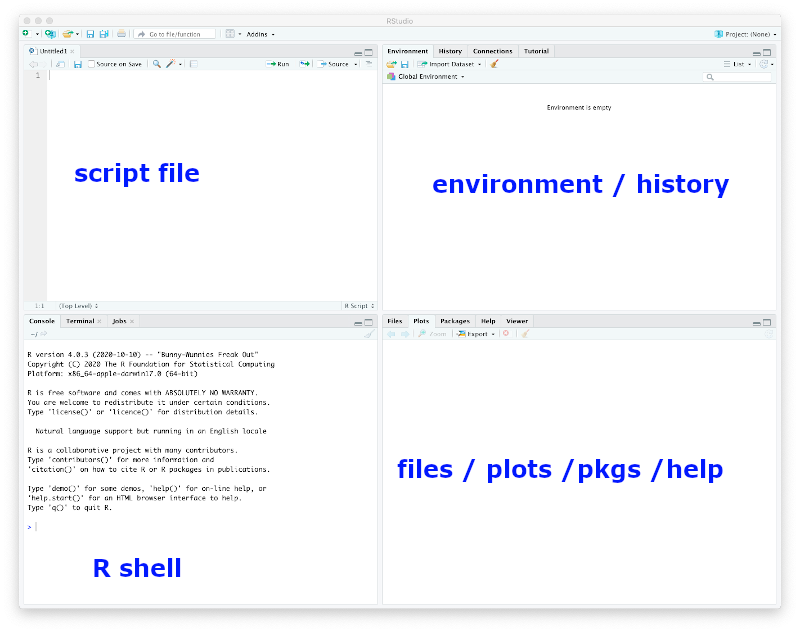

```{r setup, include=FALSE}
knitr::opts_chunk$set(echo = TRUE,
                      fig.path = "",
                      comment="", 
                      prompt=TRUE)
Sys.setlocale("LC_TIME", "C")
```

# Objectives

The learning objectives for this practical are:

  * Writing R scripts.
  * How to manipulate dates in data.
  * How to create and use factor objects.

# Setup and background

To do this practical you need an installation of R and RStudio. You can find
the instructions in the [setup](/setup#r-and-rstudio) link on how to install R
and RStudio in your system. For a smooth development of this practical, it is
strongly recommended that you follow and finish the previous
[seminar 4](/seminar4/) on how to get started with R and RStudio.

We will use the data files called `mostres_analitzades.csv` and
`virus_detectats.csv` that were generated in the
[first practical](/practical1/). If you don't have these files, please review
that practical and generate them again. Once you have obtained those two files,
copy them into a fresh new directory called `practical7`.

# Writing R scripts

We may often use an interactive R session to quickly examine data or make some
straightforward calculations. In such an interactive session, we can also recover
previous instructions in the R shell by pressing the `upwards arrow` key. However,
if we really want to keep track of the R commands we are using, we should write
them in a text file with filename extension `.R`, which we shall refer hereafter
as an _R script_. 

There are two main ways to create an R script: (1) opening a new file with a
text editor and saving it with filename that includes the `.R` extension, or (2)
if we are working with RStudio, then we click on the `File` menu and select
the options `New File` -> `R Script`. When we do that we should be getting the
RStudio window splitted in four panes, the default three ones and one additional
one for the newly created R script, as shown in the captured window below.



Type in the newly created R script (either with a text editor or with RStudio)
the following two lines to read the CSV file downloaded in the previous section.
The first line is a comment. Lines starting with the `#` symbol are comments in R.

```{r}
## read SIVIC data
dat <- read.csv("mostres_analitzades.csv", stringsAsFactors=TRUE)
```

Now save the R script in the directory `practical7` under the filename
`sivicanalysis.R`.

To execute a specific line of an R script in RStudio you should move the cursor
to that line in the pane with the script file and press the key combination
`Ctrl+Enter` (`Cmd+Enter` in Apple computers). Alternatively, you can also copy
and paste the line from the script to the R shell, specially if you are not
working with RStudio.

The previous line may produce an error if the current working directory of R is
not pointing to the directory where the file `.csv` is; see previous
[seminar 4](/seminar4/) if you need to find out how to change the working
directory in R and RStudio.

In general, changing the working directory should be always performed in the R
shell and **NEVER** include the instruction that changes the working directory
in an R script. The reason is because you or somebody else may want to run that
script in a different computer where the directory with the data may be called
differently.

You can examine the first 6 rows of the loaded CSV file with the `head()` function
as follows:

```{r}
head(dat)
```

**Exercise**: tabulate the values of the column `sexe` with the function
`table()`. Add to the script `sivicanalysis.R` the following two lines
to obtain a new `data.frame` object called `dat2` that excludes rows where
the value in the column `sexe` is `No disponible`. You have to figure out the
code that replaces de questions marks `??????`.

```{r eval=FALSE}
mask <- ??????
dat2 <- dat[mask, ]
```
Once you subset data, it is always convenient to compare the dimensions
of the original and resulting object, using the function `dim()`, and
think whether the difference in dimensions makes sense (e.g., subsetting
should always lead to a smaller object in some dimension), and whether
the number of rows in this case matches the number of `TRUE` values in the
logical mask.

```{r include=FALSE}
mask <- dat$sexe != "No disponible"
dat2 <- dat[mask, ]
```

# Date-data management

These data have two columns called `data_inici` and `data_final` that
corresponding to the begining and end of the 7-day period of the data of
that row, but which are stored as string character vectors (more
specifically as [factors](https://funcompbio.github.io/lecture6/#25)).
However, R provides a way to store dates as such and this has the
advantage that facilitates manipulating them for analysis purposes.

For instance, to transform the two columns containing date data we should
use the function `as.Date()` as follows:

```{r}
startdate <- as.Date(dat2$data_inici, "%d/%m/%Y")
enddate <- as.Date(dat2$data_final, "%d/%m/%Y")
```

Here the second argument informs the function `as.Date()` about the format
of the input dates, in this case, _day/month/4-digit-year_ corresponding to
the format string `"%d/%m/%Y`. The help page of `as.Date()` contains full
details about this. While R displays these objects as vectors of character
strings in the format _4-digit-year-month-day_, they do belong to a different
class of objects, the class *Date*.

```{r}
head(startdate)
class(startdate)
head(enddate)
class(enddate)
```


Having dates stored as _Date_-class objects facilitates operations on dates such
as calculating time differences:

1. Calculating time differences:

    ```{r}
    head(enddate - startdate + 1)
    ```
2. Caculating earliest and latest time with the `min()` and `max()` functions:

    ```{r}
    min(startdate)
    max(startdate)
    ```
3. Subsetting data for a period of time. For instance, let’s subset the
data, selecting rows corresponding to the last academic year from September
2022 to June 2023:

    ```{r}
    mask <- startdate >= as.Date("2022-09-01") & enddate <= as.Date("2023-06-30")
    sum(mask)
    dat2yr2223 <- dat2[mask, ]
    dim(dat2yr2223)
    ```
    Note that the number of `TRUE` values in the logical mask matches the resulting
    number of rows in the subsetted object `dat2yr2223`.

Date data also allows one to easily extract the month of each date. Let's extract
again the starting date this time for the subsetted data, and see how do we get
the months from those dates:

```{r}
startdate <- as.Date(dat2yr2223$data_inici, "%d/%m/%Y")
m <- months(startdate, abbreviate=TRUE)
head(m)
class(m)
```

where we have to use the argument `abbreviate=TRUE` in the `months()` function
to obtain a vector of equally sized character strings, which may be useful
for visualization purposes.

**Important:** The previous vector `m` may contain the names of the months
in a different language than English when the regional configuration of your
operating system, known as
[locale configuration](https://en.wikipedia.org/wiki/Locale_%28computer_software%29),
is also different to English. In such a case, it may be handy to switch at
least the regional time configuration to English, to facilitate following
the rest of this practical. To do that, type the following instruction on
the R shell:

```{r, eval=FALSE}
Sys.setlocale("LC_TIME", "C")
```

and then type again:
```{r}
m <- months(startdate, abbreviate=TRUE)
```
Verify that now the vector `m` has the month names in English.

# Factors

[Factors](https://funcompbio.github.io/lecture6/#25) in R are a class of objects
that serve the purpose of storing what is known in statistics as a
[categorical variable](https://en.wikipedia.org/wiki/Categorical_variable),
which is a variable that takes values from a limited number of _categories_,
also known as _levels_. So factors are pretty much like vectors of character
strings, but with additional information about what are the different values
that may occur on those vectors.

Not all vectors of character strings are suitable to become factors. For
instance, a vector of character strings corresponding to gene identifiers
tipically should not become a factor in R, because those identifiers do not
represent any kind of _category_ grouping observations.

Factors are useful, however, in the context of a statistical analysis and
data visualization, involving categorical variables. To create a factor
object we should call the function `factor()` giving a vector of character
strings as argument. Let's consider converting the previous vector `m`
of character strings to a factor.

```{r}
mf <- factor(m)
head(mf)
```
We can see that R displays factors differently to character strings, by
showing the values without double quotes (`"`) and providing additional
information about the possible _levels_ of that factor. We can access the
level information from a factor object with the functions `levels()` and
`nlevels()`.

```{r}
levels(mf)
nlevels(mf)
```
Note that we have 10 levels instead of 12, because the subsetted data
includes only the months corresponding to the academic year, i.e., from
September to June.

Sometimes, we may want the levels of a factor to comprise a set of specific
values or to be ordered in a specific way. This could be the case of the
previous factor `mf`, where we would like for instance to have the
levels corresponding to the months of the year and chronologically ordered.
We can do that as follows:

```{r}
mf <- factor(m, levels=c("Jan", "Feb", "Mar", "Apr", "May", "Jun",
                         "Jul", "Aug", "Sep", "Oct", "Nov", "Dec"))
head(mf)
levels(mf)
nlevels(mf)
```
**Important:** The previous call to the `factor()` function will **only work**
if your regional time configuration is English. If you are working with a
non-English regional time configuration, you should change the level names
in the argument `levels` to the language that you are using.

Now, we can build a contingency table of the level occurrences of a factor
using the function `table()`.

```{r}
table(mf)
```
We can see, there is no data for the months of July and August. We can remove
levels of a factor for which there is no data with the function `droplevels()`.

```{r}
mf <- droplevels(mf)
levels(mf)
table(mf)
```

One of the common uses of a factor is to aggregate numerical values by the
levels of that factor. For instance, in our previous data, the column
`positiu` contains the number of positively tested individuals, but each value
in that column corresponds to the number per week, region, sex, age group and
socioeconomical index. Let's say we want to aggregate those positively tested
individuals per month in the `data.frame` object `dat2yr2223`. We can use the
function `aggregate()` for that purpose, as follows:

```{r}
posbymonth <- aggregate(dat2yr2223$positiu, list(month=mf), sum)
```

Here the first argument is the vector (column of `dat2yr2223` in this case)
with numerical values that we want to aggregate, the second argument is a
`list` object with one element for each factor whose levels we want to use
to group the values, and the third argument is the function we want to use
to summarize the data per group. The result is a `data.frame` object with
one column per factor and a final column called `x` with the aggregate values:

```{r}
posbymonth
```

We can visualize these data in a
[scatter plot](https://en.wikipedia.org/wiki/Scatter_plot) by converting
the factor into an integer, and plotting the month into the x-axis and
the numerical value into the y-axis:

```{r posbymonth}
plot(as.integer(posbymonth$month), posbymonth$x, type="b")
```

**Exercise:** look up in the help page of the `plot()` function, how can you
change the labels for the `x` and `y` axes to a readable label whose meaning
stands alone and minimally describes the data visualized in that axis. The
resulting plot should be identical to the one above, but with the axes labels
changed.

**Exercise:** Repeat the same plot, but instead of aggregating the number
of positive cases, aggregate the positive rate by first calculating it
using the columns `total` and `positiu`, and then using the `mean()`
function to aggregate the values. Can you interpret the resulting plot?

<!--
dat2yr2223$posRate <- dat2yr2223$positiu / dat2yr2223$total *100
posRateByMonth <- aggregate(dat2yr2223$posRate, list(month=mf), mean)
plot(as.integer(posRateByMonth$month), posRateByMonth$x, type="b")

or, more numerically stable,

pbym <- aggregate(dat2yr2223$positiu, list(month=mf), sum)
tbym <- aggregate(dat2yr2223$total, list(month=mf), sum)
pct <- 100 * pbym$x / tbym$x

use this more numerically stable approach to suggest the plot below
-->

**Exercise:** Aggregate again the positive rate as in the previous exercise,
but this time by two factors, month and age group (look up in the
`data.frame` object `dat2yr2223` which column may store the age group). Assuming
the result of the function `aggregate()` is stored into a `data.frame` object
called `posrbymonthage`, plot the aggregated positive rate as function of the
month using the following plotting instruction:

```{r eval=FALSE}
plot(posrbymonthage$x ~ posrbymontage$month, xlab="Month", ylab="Positive rate")
```

The resulting plot contains so-called
[box plots](https://en.wikipedia.org/wiki/Box_plot) for each month, which allow
one to visualize the location and spread of the data in terms of
[quartiles](https://en.wikipedia.org/wiki/Quartile). How would you interpret the
different sizes of the boxes throughout the months of the year?

<!--
dat2yr2223$month <- month=mf
posrbymonthage <- aggregate(x = dat2yr2223$posRate,by = list(month=mf, edat= dat2yr2223$grup_edat) , mean)
plot(posrbymonthage$x ~ posrbymonthage$month, xlab="Month", ylab="Positive rate")
-->
