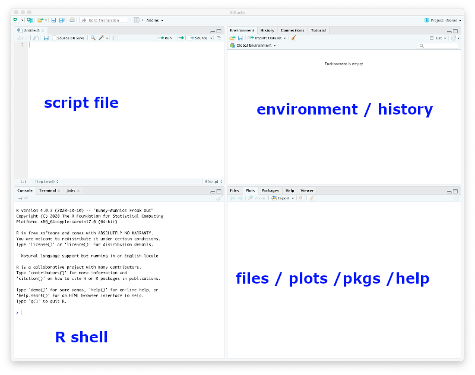

# Objectives

The learning objectives for this practical are:

-   Writing R scripts.
-   How to manipulate dates in data.
-   How to create and use factor objects.

# Setup and background

To do this practical you need an installation of R and RStudio. You can
find the instructions in the [setup](/setup#r-and-rstudio) link on how
to install R and RStudio in your system. For a smooth development of
this practical, it is strongly recommended that you follow and finish
the previous [seminar 4](/seminar4/) on how to get started with R and
RStudio.

We will download some COVID19 data to illustrate the use of R and
RStudio. Please follow the next two steps:

1.  Go to the Catalan Health Departament COVID19 data portal at
    <https://dadescovid.cat> and switch the language to “ENGLISH” using
    the pull-down menu on the top-right corner of the page.
2.  Follow the downloads link and on the next page click and download
    the file corresponding to the “7 DAY AGGREGATION” for “CATALUNYA”.
    Make sure you know exactly where in your filesystem this file has
    been downloaded. **Tip:** some browsers automatically download files
    into a folder called “Downloads” or under a name corresponding to
    the translation of “Downloads” to the default language of your
    operating system.
3.  Make a directory in your filesystem, for instance at your *home*
    directory, called `practical7` and copy in it the downloaded file.
4.  Since the downloaded file is a ZIP file, uncompress as you did in
    [practical 1](/practical1/) so that you finally have a file called
    `catalunya_setmanal.csv` in the directory `practical7`.

If you are using the UPF [myapps](https://myapps.upf.edu) cloud to run
RStudio, then you need to either use an internet browser in *myapps* to
download the data file directly in the *myapps* cloud or upload to the
*myapps* cloud the file that you have downloaded in your own computer.

# Writing R scripts

We may often use an interactive R session to quickly examine data or
make some straightforward calculations. In such an interactive session,
we can also recover previous instructions in the R shell by pressing the
`upwards arrow` key. However, if we really want to keep track of the R
commands we are using, we should write them in a text file with filename
extension `.R`, which we shall refer hereafter as an *R script*.

There are two main ways to create an R script: (1) opening a new file
with a text editor and saving it with filename that includes the `.R`
extension, or (2) if we are working with RStudio, then we click on the
`File` menu and select the options `New File` -> `R Script`. When we do
that we should be getting the RStudio window splitted in four panes, the
default three ones and one additional one for the newly created R
script, as shown in the captured window below.

Type in the newly created R script (either with a text editor or with
RStudio) the following two lines to read the CSV file downloaded in the
previous section. The first line is a comment. Lines starting with the
`#` symbol are comments in R.

    > ## read COVID19 data
    > dat <- read.csv("catalunya_setmanal.csv", sep=";", stringsAsFactors=TRUE)

Now save the R script in the directory `practical7` under the filename
`covid19analysis.R`.

To execute a specific line of an R script in RStudio you should move the
cursor to that line in the pane with the script file and press the key
combination `Ctrl+Enter`. Alternatively, you can also copy and paste the
line from the script to the R shell, specially if you are not working
with RStudio.

The previous line may produce an error if the current working directory
of R is not pointing to the directory where the file
`catalunya_setmanal.csv` is; see previous [seminar 4](/seminar4/) if you
need to find out how to change the working directory in R and RStudio.
In general, changing the working directory should be always performed in
the R shell and **NEVER** include the instruction that changes the
working directory in an R script. The reason is because you or somebody
else may want to run that script in a different computer where the
directory with the data may be called differently.

Add to the script `covid19analysis.R` the necessary code to obtain a new
`data.frame` object including only data from the general population,
i.e., excluding data from geriatric residences.

# Date-data management

These are the first 6 rows of the previously loaded CSV file:

    > head(dat)

            NOM      CODI   DATA_INI    DATA_FI RESIDENCIA IEPG_CONFIRMAT
    1 CATALUNYA CATALUNYA 2020-11-02 2020-11-08         Si             NA
    2 CATALUNYA CATALUNYA 2020-11-02 2020-11-08         No        594.686
    3 CATALUNYA CATALUNYA 2020-11-02 2020-11-08         --             NA
    4 CATALUNYA CATALUNYA 2020-11-01 2020-11-07         No        619.898
    5 CATALUNYA CATALUNYA 2020-11-01 2020-11-07         --             NA
    6 CATALUNYA CATALUNYA 2020-11-01 2020-11-07         Si             NA
      R0_CONFIRMAT_M      IA14 TAXA_CASOS_CONFIRMAT CASOS_CONFIRMAT TAXA_PCR_TAR
    1             NA 2841.0884            1420.5442             900    16604.584
    2       0.867578  685.4556             301.7109           23042     3113.298
    3             NA    0.0000               0.0000             533        0.000
    4       0.886494  699.2697             310.1696           23688     3157.961
    5             NA    0.0000               0.0000             547        0.000
    6             NA 2883.7047            1474.2092             934    16793.989
         PCR   TAR PERC_PCR_TAR_POSITIVES INGRESSOS_TOTAL INGRESSOS_CRITIC EXITUS
    1   8445  2075                10.4716             112                5    151
    2 175816 61950                10.6273            1528              293    319
    3   3827   177                 7.0064              67               14      0
    4 179829 61348                10.7125            1566              294    321
    5   3846   166                 7.0666              71               14      0
    6   8552  2088                10.6121             119                5    143

It has two columns with date information (`DATA_INI` and `DATA_FI`), but
which are stored as string characters (more specifically *factors*).
However, R provides a way to store dates as such and this has the
advantage that facilitates manipulating them for analysis purposes.

For instance, to transform the two columns containing date data we
should use the function `as.Date()` as follows:

    > startdate <- as.Date(dat$DATA_INI)
    > enddate <- as.Date(dat$DATA_FI)

While R displays these objects as vectors of character strings, they do
belong to a different class of objects, the class *Date*.

    > head(startdate)

    [1] "2020-11-02" "2020-11-02" "2020-11-02" "2020-11-01" "2020-11-01"
    [6] "2020-11-01"

    > class(startdate)

    [1] "Date"

    > head(enddate)

    [1] "2020-11-08" "2020-11-08" "2020-11-08" "2020-11-07" "2020-11-07"
    [6] "2020-11-07"

    > class(enddate)

    [1] "Date"

Having dates stored as *Date*-class objects facilitates operations on
dates such as calculating time differences:

    > head(enddate - startdate + 1)

    Time differences in days
    [1] 7 7 7 7 7 7

or extracting the month of each date:

    > m <- months(startdate, abbreviate=TRUE)
    > head(m)

    [1] "Nov" "Nov" "Nov" "Nov" "Nov" "Nov"

    > class(m)

    [1] "character"

where we have to use the argument `abbreviate=TRUE` in the `months()`
function to obtain a vector of equally sized character strings, which
may be useful for visualization purposes.

**Important:** The previous vector `m` may contain the names of the
months in a different language than English when the regional
configuration of your operating system, known as [locale
configuration](https://en.wikipedia.org/wiki/Locale_%28computer_software%29),
is also different to English. In such a case, it may be handy to switch
at least the regional time configuration to English, to facilitate
following the rest of this practical. To do that, type the following
instruction on the R shell:

    > Sys.setlocale("LC_TIME", "C")

and then type again:

    > m <- months(startdate, abbreviate=TRUE)

Verify that now the vector `m` has the month names in English.

# Factors

Factors in R are a class of objects that serve the purpose of storing
what is known in statistics as a [categorical
variable](https://en.wikipedia.org/wiki/Categorical_variable), which is
a variable that takes values from a limited number of *categories*, also
known as *levels*. So factors are pretty much like vectors of character
strings, but with additional information about what are the different
values that may occur on those vectors.

Not all vectors of character strings are suitable to become factors. For
instance, a vector of character strings corresponding to gene
identifiers tipically should not become a factor in R, because those
identifiers do not represent any kind of *category* grouping
observations.

Factors are useful, however, in the context of a statistical analysis
and data visualization, involving categorical variables. To create a
factor object we should call the function `factor()` giving a vector of
character strings as argument. Let’s consider converting the previous
vector `m` of character strings to a factor.

    > mf <- factor(m)
    > head(mf)

    [1] Nov Nov Nov Nov Nov Nov
    Levels: Apr Aug Feb Jul Jun Mar May Nov Oct Sep

We can see that R displays factors differently to character strings, by
showing the values without double quotes (`"`) and providing additional
information about the possible *levels* of that factor. We can access
the level information from a factor object with the functions `levels()`
and `nlevels()`.

    > levels(mf)

     [1] "Apr" "Aug" "Feb" "Jul" "Jun" "Mar" "May" "Nov" "Oct" "Sep"

    > nlevels(mf)

    [1] 10

Sometimes, we may want the levels of a factor to comprise a set of
specific values or to be ordered in a specific way. This could be the
case of the previous factor `mf`, where we would like for instance to
have the levels corresponding to the months of the year. We can do that
as follows:

    > mf <- factor(m, levels=c("Jan", "Feb", "Mar", "Apr", "May", "Jun",
    +                          "Jul", "Aug", "Sep", "Oct", "Nov", "Dec"))
    > head(mf)

    [1] Nov Nov Nov Nov Nov Nov
    Levels: Jan Feb Mar Apr May Jun Jul Aug Sep Oct Nov Dec

    > levels(mf)

     [1] "Jan" "Feb" "Mar" "Apr" "May" "Jun" "Jul" "Aug" "Sep" "Oct" "Nov" "Dec"

    > nlevels(mf)

    [1] 12

**Important:** The previous call to the `factor()` function will **only
work** if your regional time configuration is English. If you are
working with a non-English regional time configuration, you should
change the level names in the argument `levels` to the language that you
are using.

Now, we can build a contingency table of the level occurrences of a
factor using the function `table()`.

    > table(mf)

    mf
    Jan Feb Mar Apr May Jun Jul Aug Sep Oct Nov Dec 
      0  18  93  90  93  90  93  93  90  93   6   0 

We can see, there is no data in 2020 for the months of January (because
data was not yet recorded) and December (because it was November at the
time of elaborating this practical). We can remove levels of a factor
for which there is no data with the function `droplevels()`.

    > mf <- droplevels(mf)
    > levels(mf)

     [1] "Feb" "Mar" "Apr" "May" "Jun" "Jul" "Aug" "Sep" "Oct" "Nov"

    > table(mf)

    mf
    Feb Mar Apr May Jun Jul Aug Sep Oct Nov 
     18  93  90  93  90  93  93  90  93   6 

Add the necessary lines of code to the script `covid19analysis.R` to
create a factor object with the months in which each data row was
recorded in the general population, i.e., excluding data from geriatric
residences. Using this factor we can easily visualize the distribution
of the columns `R0_CONFIRMAT_M` (R0 basic reproduction number) and
`IEPG_CONFIRMAT` (risk of outbreak) in the general population, as
function of the month, calling plot with the formula notation `x ~ y`:

    > plot(datg$R0_CONFIRMAT_M ~ mf)

 where here `datg` refers to the subset of the
original `data.frame` object `dat`, excluding data from geriatric
residences, and `mf` refers to the factor object with the months from
that subset of data. The resulting plot contains so-called [box
plots](https://en.wikipedia.org/wiki/Box_plot) for each month, which
allow to visualize the location of the data in terms of
[quartiles](https://en.wikipedia.org/wiki/Quartile).

Once you have obtained the plot, look up in the help page of the
`plot()` function, how can you change the labels for the `x` and `y`
axes to a more readable label. The resulting plot should be similar to
the one above

We can see that February has no data points for the column
`R0_CONFIRMAT_M` despite there are data rows for that month. To find out
why we do not see any data on the plot we can inspect the values of
`R0_CONFIRMAT_M` for the month of February as follows:

    > datg$R0_CONFIRMAT_M[mf == "Feb"]

    [1] NA NA NA NA NA NA

The value `NA` in R means *not available* and R treats it in a special
way depending on the operation that is performing. In the case of plots,
`NA` values are ignored.

Plot now the risk of outbreak as function of the month, can you identify
the month in which this risk has increased the most? Add the two
plotting instructions to the `covid19analysis.R` script.

    > ## plot risk of outbreak as function of the month
    > plot(datg$IEPG_CONFIRMAT ~ mf, xlab="Month", ylab="Risk of outbreak")
